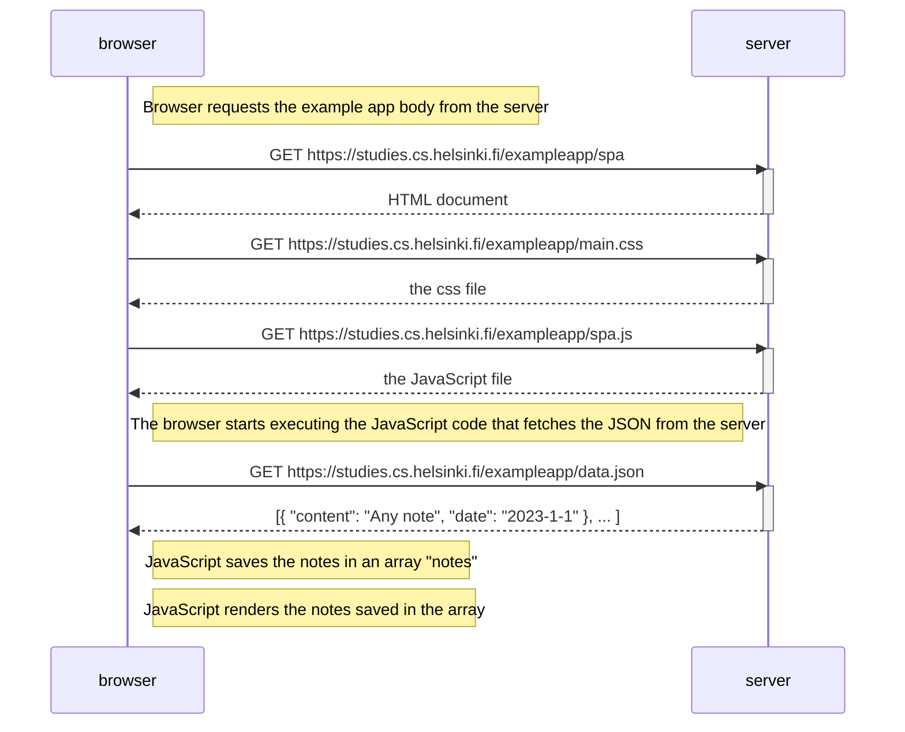

## Sequence Diagram for load example spa

### Important note: The example of a sequence diagram given by Full Stack Open was used as a reference: https://fullstackopen.com/en/part0/fundamentals_of_web_apps#loading-a-page-containing-java-script-review