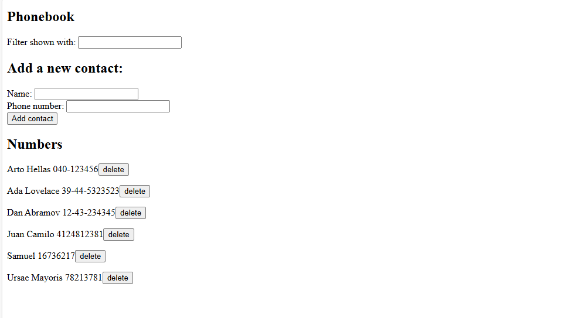

## Phonebook / Agenda Telefonica
Website: https://phonebook-guvi.onrender.com/

- This is a project developed as an exercise to apply the knowledge acquired in the Full Stack Course (offered by University of Helsinki)
- The website consists in a basic system to save contacts in a phonebook, contacts are saved in a NonSQL database (using Mongo DB ATLAS)
- Frontend was developed using React VITE and backend was developed using Node JS Express

## Webise preview

**Author:** Juan Camilo Ramirez Tabares