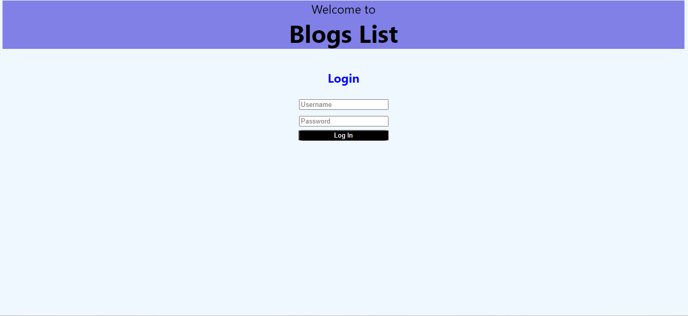
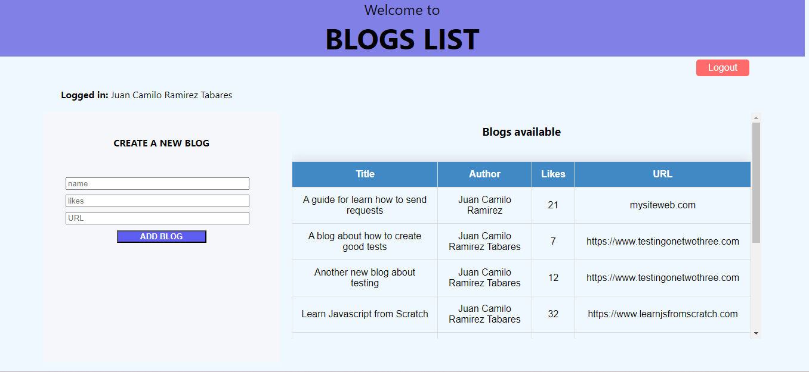

# Welcome to Blogs List
#### Exercises of the part 5

This is an app created to save your own simple blogs. It's part of the exercises from the Full Stack Open course. The app is implemented as an SPA (Single Page Application).

It is being implemented using REACT (frontend) and Express (backend), which also uses a MongoDB connection.

### The app includes:

### Login session

### BlogList page (main page)

Author: Juan Camilo Ramirez Tabares